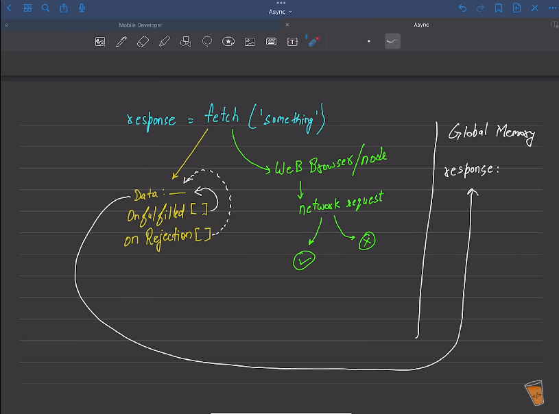

# FETCH()
fetch() is used to send a request to api and returns a promise. The promise is handled by .then for successful response and .catch for errors. fetch() has aync behaviour bcz it gets pushed to macro task queue but returns promise which is pushed to micro task queue.

A fetch() promise can only be reject when network error is encounterd like no internet connection. even if it encounters HTTP error (404) it don't trigger rejection because it is a response(not a network error). So, you need to manully check response by checking response.ok 

One can pass headers in form of objects to fetch() like fetch("API link",{headers}). 

Ex- fetch("API link",{method:'GET'})  

Just fetch single keyword do a lot of things under the hood. There are two parts one is Web API and another is core JS.

***fetch is divided into two parts:*** 
1. **Core JS**: when fetch is used it create a memory location(data) that can only filled by onfulfilled and onrejection internal slots. These internal slots and "data" are cannot be accessed or manupulated manually. These internal slots gets value from web browser/JRE. the array accept a fn that fills the "data" memory location. 
2. **Web Browser/JRE**: Fetch() sends a network request to api. The request can only get a response or a rejection.
    - case 1 - gets a response: if request gets a response then the response gets passed to onfulfilled handler(fn) and handler fills the "data".
    - case 2 - gets a rejection: if request gets an error(HTTP errors only) then the error gets passed to onrejection handler(fn) and handler fills the "data".
    