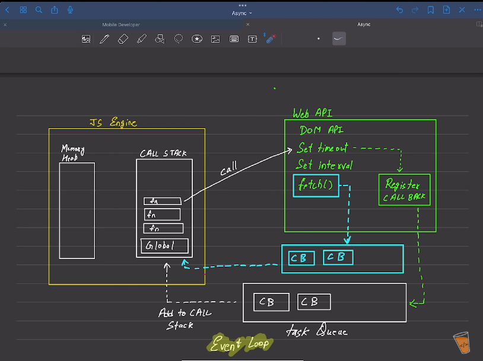

# Execution Of JS

## JS ENGINE
The core JS(JS engine) is synchronus and only has two components.
1. ***Memory Heap*** - 
    - Memory Heap stores the values of variables in a heap thats why two variables that have same value are refereced to same memory location in the heap.
    - === and == only compare two variables value by their memory location. if memory location is same then the values are equal.(Applies to Objects only)
2. ***Call Stack*** - 
    - There is a stack(LIFO) in which maintains the order of the execution & all the calls  that are stacked on one another. Every task is pushed into call stack firstly.
    - Task on the top of the call stack is executed first. At bottom there is global context (window in browser's context) on top of which fn calls are executed.

But there are things in javascript runtime environment(node,dino,browser) that provide additional functionality to get non blocking and asyc behaviour.

there are web API, micro task queue (priorty queue) and macro task queue that contribute for async behaviour.

## Web API
The functionalities that are provided by JRE and are not the part of JS engine are called web API. The additional features like DOM, setInterval, setTimeout, fetch are part Web API's.

Depending upon the task, the task gets pushed into two types of queue:
1. ***Micro task queue(Priority queue)***: This queue gets get executed(1st priority) after call stack is empty.

    List of task that gets pushed into Micro task queue:- 
    - Promises (.then, .catch, .finally)
    - MutationObserver(DOM)
    - queueMicrotask() - Direct fn
2. ***Macro Task queue(Task queue)***: This queue gets executed(2nd priority) after call stack and mirco task queue is empty.

    List of task that gets pushed into Macro task queue:-
    - setTimeout(), setInterval()
    - setImmediate() (Node.js only)
    - I/O tasks (XHR, fetch())
    - Events (e.g., click, keydown)

## Event Loop
Event loop is an algorithm that manages asyc order of execution.This makes JavaScript run synchronously with asynchronous behavior. It constantly checks if queue(s) have any task in them. 

First Micro task queue then macro task queue tasks are pushed into call stack and get excuted. This makes javascript running synchronusly with asynchronus behaviour.

## How it works??
Different task are executed differently
- ***functions*** - These are executed one by one in call stack
- ***fn inside a fn*** - First outer fn then inner fn is pushed into the call stack BUT as call stack is a stack so inner fn is excuted first(bcz inner fn is on top of the call stack) then outer fn.
- ***Web API*** -
    1. **Micro task queue tasks** - The task gets pushed into call stack then called to Web API and processed by the Web API and then pushed into the microtask queue. After the call stack is empty, the event loop moves tasks from the microtask queue to the call stack for execution.
    2. **Macrotask queue tasks**: Similar to microtasks, but they get pushed into the macrotask queue and after the call stack and microtask queue are empty, the event loop moves tasks from the microtask queue to the call stack for execution.